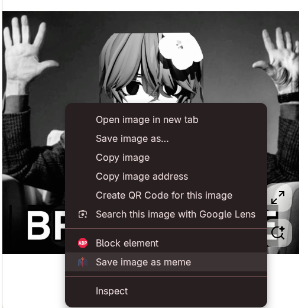
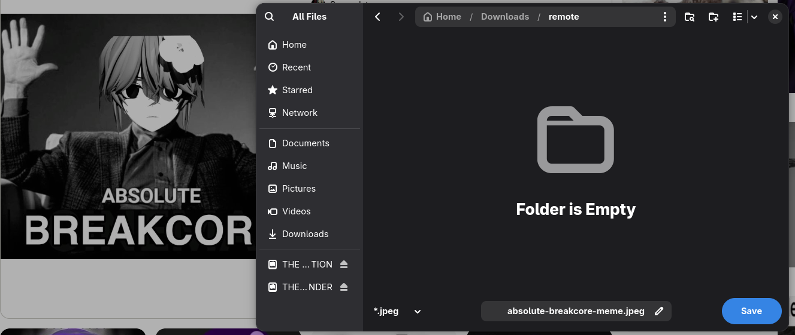
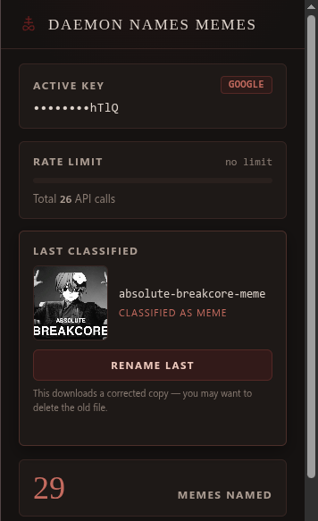
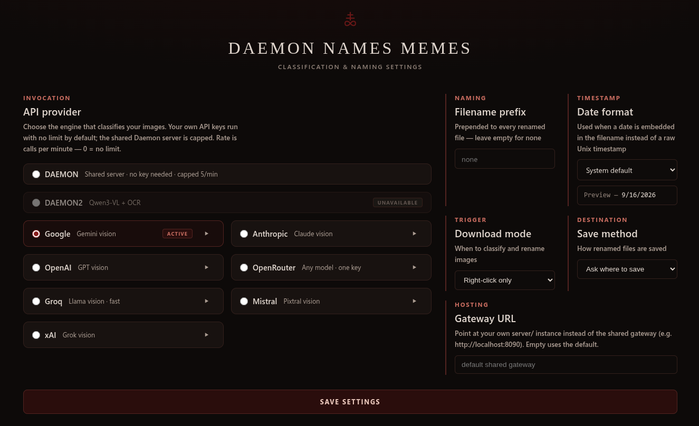

<a id="english"></a>
<p align="center">
  
</p>
<div align="center">

  **[English](#english) | [Русский](#russian)**
</div>

---

<a id="english"></a>

A browser extension that renames images as you save them: 
1. Right-click any image
2. "Save image as meme"
3. A vision model classifies it and the file is saved with a meaningful name (`absolute-breakcore-meme.jpeg`)

Naming is in the meme's own language and script or with a clean date if it's not a meme.

## Extension

**Right-click a meme, rename it.** The extension adds "Save image as meme"
to the browser's native context menu — no separate UI to open, no extra
click beyond the one you'd make anyway to save the image.

<p align="center">
  
<p>

**The file lands with a real name.** Instead of `image (4).jpeg`, the save
dialog offers a slug the vision model generated from what's actually in the
picture — here `absolute-breakcore-meme.jpeg`.

<p align="center">
  
<p>

**The popup tracks what just happened.** Active provider and key, this
session's rate-limit usage, a thumbnail of the last classification with a
one-click "Rename last" if the model got it wrong, and a running count of
memes named.

<p align="center">
  
<p>

**Settings covers the rest.** Pick a classification provider (or bring your
own API key), set a filename prefix and date format, choose when renaming
triggers and where files save, and optionally point the extension at your
own gateway instance.

<p align="center">
  
<p>

---

### What it can do

- Works with plenty of AI providers. Use your own key for Google, Anthropic,
  OpenAI, OpenRouter, Groq, Mistral, or xAI. Or just use the shared Daemon
  server and skip the key entirely.

> To get a free Gemini API key without linking a card, go to Google AI Studio, log in with your Google account, and click the "Get API key" button. Google may change the terms.

- Smart limits. Your own keys have no limit by default. The shared Daemon
  server is capped at 5 calls a minute, enforced server side.
- Every BYO-key provider ships with a sane default model, but you can pin a
  different one per provider in Settings (e.g. swap Gemini's flash-lite for
  a bigger vision model) — leave it blank to keep using the default.
- Optional prefix for every renamed file; pick your date format for
  non-memes; a stats dashboard in the popup; EN + RU localization.

### How to start

1. Open `chrome://extensions` in any Chromium browser.
2. Turn on Developer mode.
3. Click "Load unpacked" and pick the `extension` folder.

### Provider lineup

| Provider   | Keyless | Default limit              | Good to know                                                                                                                                             |
| ---------- | ------- | -------------------------- | -------------------------------------------------------------------------------------------------------------------------------------------------------- |
| DAEMON     | Yes     | 5 per minute (server side) | The default. Shared server, Gemini.                                                                                                                      |
| DAEMON2    | Yes     | —                          | *(Unavailable)*`service/` (Qwen3-VL-4B + OCR) — see below. Shown as a disabled card in Settings; can't be selected until it's actually hosted somewhere. |
| Google     | No      | No limit                   | Gemini vision                                                                                                                                            |
| Anthropic  | No      | No limit                   | Claude vision                                                                                                                                            |
| OpenAI     | No      | No limit                   | GPT vision                                                                                                                                               |
| OpenRouter | No      | No limit                   | One key for lots of models                                                                                                                               |
| Groq       | No      | No limit                   | Llama vision, very fast                                                                                                                                  |
| Mistral    | No      | No limit                   | Pixtral vision                                                                                                                                           |
| xAI        | No      | No limit                   | Grok vision                                                                                                                                              |

Your keys stay in your browser and only go to the provider you picked.

---

## Cloudflare Worker (`worker/`)

Only needed if you want the keyless Daemon provider:

```bash
cd worker
npm install
npx wrangler secret put GEMINI_API_KEY
npm run deploy
```

The deploy applies a Durable Object migration (`new_sqlite_classes`) that
powers per-IP server-side rate limiting (free plan needs SQLite-backed DOs;
the config already uses them). `npm run dev` / `npm test` (vitest) for local
development.

---

## Classifier service (`service/`)

A portable alternative to the shared Daemon worker: a plain HTTP JSON API in
a standard Docker container that runs identically on any Docker-capable
host. No platform-specific code — all host configuration is env vars
(single config layer, `service/.env.example`). It isn't a hosted product —
this is alpha software, so running it means running it yourself somewhere.

### Architecture: two-stage pipeline

```
image (base64) ──► OCR pre-pass ──┬─ manual mode, conf ≥ threshold ──► slug from text, VLM skipped
                                  └─ otherwise ──────────────────────► Qwen3-VL-4B VLM ──► {isMeme, filenameSlug}
```

- **VLM**: `Qwen/Qwen3-VL-4B-Instruct-GGUF` (Q4_K_M, ~2.5 GB) + Q8_0 mmproj,
  served by llama-cpp-python, CPU-only, grammar-constrained JSON output.
  Images downscaled to ≤384 px before inference (benchmarked: 29 s vs 622 s
  at 1024 px, identical classification output).
- **OCR**: pluggable engine — `rapidocr` (default, ONNX/CPU, real confidence
  scores, dedicated Cyrillic pack), `lightonocr` (LightOnOCR-2-1B via
  transformers, optional heavy install), or `none`.
- **Modes** (request field `mode`):
  - `manual` — the user explicitly chose "save as meme", so `isMeme` is
    `true` by definition. OCR runs first; if its confidence ≥
    `OCR_CONFIDENCE_THRESHOLD` (named constant, default **0.7**), the slug is
    built directly from the recognized text in its native script (never
    transliterated) and the VLM is skipped. Below threshold → VLM generates
    the slug; no text + no locale → English slug.
  - `auto` — unattended (downloads-API callback). The VLM **always** runs —
    it's the only stage deciding `isMeme`. OCR runs first as a cheap
    pre-pass; high-confidence text is injected into the VLM prompt as
    "detected text" context. Per-request latency is logged as three separate
    numbers: `ocr=`, `vlm=`, `total=`.

### API contract

`POST /classify`

<p align="center">
  
<p>

```json
// request
{"image": "<base64>", "mimeType": "image/png", "locale": "ru", "mode": "manual"}

// response (success) — exactly this shape, no "tags"
{"isMeme": true, "filenameSlug": "бедный-хомячок-в-ложке"}

// response (any failure) — JSON error contract, never an HTML error page
{"isMeme": false, "filenameSlug": "unknown", "error": "invalid_image"}
```

Error types: `empty_image`, `payload_too_large`, `invalid_base64`,
`invalid_image`, `invalid_json_body`, `invalid_field_types`, `invalid_mode`,
`model_loading_timeout`, `model_unavailable`, `model_load_error`,
`bad_model_output`, `internal_error`, or a generation exception class name.

`GET /health` → VLM + OCR stage status. CORS: `Access-Control-Allow-Origin: *`
on **every** response path (success, errors, 500s, preflight) — the caller is
a `chrome-extension://` origin.

```bash
IMG=$(base64 -w0 meme.png)
curl -s -X POST http://localhost:8080/classify \
  -H "Content-Type: application/json" \
  -d "{\"image\": \"$IMG\", \"mimeType\": \"image/png\", \"locale\": \"ru\", \"mode\": \"manual\"}"
```

```js
// from the extension's background script
const res = await fetch("https://<HOST>/classify", {
  method: "POST",
  headers: { "Content-Type": "application/json" },
  body: JSON.stringify({ image: base64, mimeType: "image/png", locale, mode: "manual" }),
});
const { isMeme, filenameSlug } = await res.json();
```

### Running it

```bash
cd service
docker build -t daemon-names-memes .
docker run --rm -p 8080:8080 \
  -v dnm-model-cache:/root/.cache/huggingface \
  daemon-names-memes
```

The 3 GB of model weights download on first boot (mount a volume to make
restarts instant, or pre-seed `service/models/`). Requirements: **≥ 4 GB RAM**
(VLM Q4_K_M peaks ~3.5 GB RSS), any x86_64 Docker host, outbound access to
huggingface.co. CPU-only; expect multi-second latency per request (~20–30 s
at 384 px on a 4–12-thread CPU) and several-minute cold starts. **Cold start
is not the constraint worth optimizing right now** — see "Deployment
platforms" below: there's currently no free tier that can even boot this
container, so a slow boot on a host we can't launch on is moot. Do not "fix"
the model/quantization to shave latency without discussing it first.

### Rate limiting

`service/` has no authentication, so anyone with the URL can call
`/classify`, and the single shared VLM already serializes every request
behind one lock at 20–30 s each. A per-IP sliding-window rate limiter
(`service/ratelimit.py`) is enabled by default for standalone
deployments. When `service/` runs behind the shared gateway (`server/`,
see below), the gateway's Redis-backed per-provider limiter takes over the
business rule and nginx adds a coarse IP-based edge layer in front. The
Cloudflare Worker (`worker/`) keeps its own server-side limit (5/min,
Durable Object) so it stays safe for direct callers too.
### Deployment platforms (portability proof)

The image is host-agnostic; only the deploy commands differ.

**Fly.io** (paid instance, e.g. `shared-cpu-2x` with 4 GB):

```bash
fly launch --image <registry>/daemon-names-memes --no-deploy
fly volumes create dnm_models --size 5      # persists the HF cache
fly deploy
```

**Any Docker VPS** (Hetzner/DO/…), zero platform coupling:

```bash
docker pull <registry>/daemon-names-memes
docker run -d --restart unless-stopped -p 8080:8080 \
  -v /opt/dnm/models:/root/.cache/huggingface \
  -e OCR_CONFIDENCE_THRESHOLD=0.7 \
  daemon-names-memes
```

Notes on free tiers as of 2026-09: **HF Spaces** rejects Gradio/Docker Spaces
on the free tier (PRO required); **Render** free tier doesn't run Docker at
all and its paid 2 GB Starter OOMs this model (needs ≥4 GB); **Fly.io** has
no free tier anymore. There is currently **no genuinely free host** that fits
a 4 GB-RAM CPU model container — budget ~$5–10/mo for a small VPS, which is
also the most portable option.

### OCR model selection


| Criterion | RapidOCR (PP-OCRv5, ONNX) | LightOnOCR-2-1B (transformers) |
|---|---|---|
| Cyrillic support | ✅ dedicated `cyrillic` rec pack (ru/be/uk/bg/sr + en); also `ru`, `eslav` | ❌ documented languages: en/fr/de/es/it/nl/pt/sv/da/zh/ja — **no Russian** |
| Confidence scores | ✅ real per-line rec scores → threshold works as specified | ❌ none — heuristic constant (0.9 on non-empty output), not a measurement |
| CPU latency (typical) | ~0.2–1 s per image | multi-second; autoregressive 1B VLM on CPU |
| RAM cost | ~300 MB | ~2 GB extra on top of the VLM |
| Install weight | small (ONNX Runtime) | torch + transformers≥5 (~3 GB of packages) |
| Stylized/impact-font memes | weaker (trained on documents/scenes) | stronger (end-to-end VLM OCR) |
| License | Apache-2.0 (model © Baidu) | Apache-2.0 |

**Provisional pick: RapidOCR (`cyrillic` pack) as default**, because for
*this* pipeline — Cyrillic meme captions, a real confidence threshold,
sub-second pre-pass inside an auto-mode timing budget, minimal RAM on top of
the 3.5 GB VLM — it wins on every axis except stylized-font robustness.
LightOnOCR's lack of documented Cyrillic support alone nearly rules it out
for the RU use case; its no-confidence-score limitation also breaks the
threshold semantics the manual-mode fast path depends on. Both engines are
implemented and switchable via `OCR_ENGINE` env var, so the benchmark can
settle it empirically.

### Configuration

All knobs are env vars — see `service/.env.example` (server, request guards,
VLM model files/resolution/threads, OCR engine/language/threshold, slug
limits). Nothing host-specific is hardcoded anywhere.

---

## Shared gateway (`server/`)

By default the extension routes every provider — Daemon (`worker/)`,
Daemon2 (`service/`) and all BYO-key providers — through the project's own
gateway (`OWNER_GATEWAY_URL` in `extension/background.js`; users can point
the extension at their own instance via Settings → Gateway URL). One
gateway means one shared dataset, and it's deliberately lite: **caching +
metrics only**, no model of its own and no rate limiting of its own.

- **Shared pHash cache (Redis).** Every classification result, from any
  provider, is cached by perceptual hash (Hamming threshold 8, named
  constant). A meme one user classified through Gemini is served instantly
  from cache to another user requesting it through Claude — cache keys are
  provider-agnostic on purpose. A cache hit skips the model call entirely
  (actively gates, not log-only). Cache lookups use a multi-index Hamming
  search instead of loading the whole cache per request; `CACHE_TTL_S`
  works per entry.
- **No gateway rate limiter.** Limits stay where they already live: nginx
  `limit_req` at the edge, `service/`'s own per-IP limiter, the worker's
  Durable Object, and your own quota for BYO keys. Upstream `429`s reach the
  extension as `429` with `retry_after_seconds`.
- **Shared metrics log (SQLite).** Every request logs provider, mode,
  per-stage latency, cache hit + Hamming distance, errors, and correction
  events (`was_correction`, `previous_wrong_slug`,
  `correction_was_cache_hit`). `manual_override_is_meme` is a nullable
  column for hand-labeling samples later. `python analyze_metrics.py --db
  /data/metrics.sqlite3` reports cache hit rate, Hamming distribution of
  actual hits, OCR→VLM fallback rate, p50/p95/p99 latency per stage,
  false-negative rate over labeled rows, and correction rate split by
  scenario (high cache-hit corrections → threshold too loose; high
  fresh-call corrections → prompt/model needs work).
- **Not bound to daemon2.** The gateway never runs a model and doesn't
  bundle `service/`: every provider is an async HTTP call. daemon2 is
  opt-in via `SERVICE_URL` (answers `503` without it; cache hits are still
  served). The default provider is `worker`.
- **Scales out.** Async Redis + pooled HTTP client, image hashing off the
  event loop, batched background SQLite writer, several uvicorn workers
  (`WEB_CONCURRENCY`).
- **Hosts next to other apps.** Unique compose project name; nginx is
  published on `127.0.0.1:8090` (not `0.0.0.0:80`), Redis and the app are
  never published; nginx only serves `/classify`, `/correct`, `/health`
  and overwrites `X-Forwarded-For` so clients can't spoof their IP. Put your
  existing reverse proxy in front and set `NGINX_TRUSTED_PROXY`.

```bash
cd server && docker compose up -d --build                     # gateway + Redis + nginx
SERVICE_URL=http://service:8080 docker compose --profile daemon2 up -d --build   # + daemon2
```

Then set `OWNER_GATEWAY_URL` in `extension/background.js` to the deployed
URL. All settings (all optional): `server/.env.example`. Details:
`server/README.md`.

### Viewing gateway statistics

Run from `server/` while the stack is up (`docker compose` or `podman
compose`):

```bash
# summary: cache hit rate, Hamming distances, latency p50/p95/p99, corrections
docker compose exec app python analyze_metrics.py            # add --days N to limit

# last 10 requests: time | provider | mode | cache hit | distance | name | error | seconds
docker compose exec app python -c "import sqlite3; c=sqlite3.connect('/data/metrics.sqlite3'); [print(*r, sep=' | ') for r in c.execute(\"select datetime(ts,'unixepoch','localtime'), provider, mode, cache_hit, cache_hamming_distance, filename_slug, error, round(total_seconds,2) from classification_log order by id desc limit 10\")]"

# what is cached right now: pHash -> name
docker compose exec redis sh -c 'for k in $(redis-cli --scan --pattern "dnm:cache:e:*"); do echo "$k $(redis-cli get $k)"; done'

# live gateway log (MISS/HIT, provider errors)
docker compose logs -f app

# health: Redis, cache settings, configured providers
curl http://localhost:8090/health
```

Example from a local run (a repeated image is served from the cache in
~0.01 s instead of 3.6–4.5 s through the model, whichever provider asks):

```
2026-09-16 10:24:04 | google | manual | 1 | 0    | связи-между-девушками-и-парнями | None | 0.01
2026-09-16 10:24:01 | google | manual | 0 | None | связи-между-девушками-и-парнями | None | 4.49
2026-09-16 10:22:29 | google | manual | 1 | 0    | good-experience-vs-everything   | None | 0.01
2026-09-16 10:22:21 | google | manual | 0 | None | good-experience-vs-everything   | None | 3.63
2026-09-16 10:17:49 | claude | auto   | 1 | 0    | when-the-cache-finally-works    | None | 0.17
2026-09-16 10:17:41 | worker | auto   | 0 | None | when-the-cache-finally-works    | None | 1.06
```

The "OCR fast-path vs VLM fallback" block of `analyze_metrics.py` is only
meaningful for `daemon2`; other providers in manual mode show up there as
100% fallback.

### "Rename last" correction flow

The popup's **Rename last** button re-runs classification on the last image
with the rejected slug injected as an explicit negative example ("produce a
different, more accurate description — do not repeat the previous answer"),
then re-downloads the image under the corrected name.

> **Limitation (by design):** Chrome extensions cannot rename files on
> disk after download. This downloads a **corrected copy**, so you may want
> to delete the old file. The popup says so next to the button.

Two server-side scenarios:

- **Last result was a cache hit**: force a fresh model pass, then
  **overwrite the cache entry** for that pHash, so everyone who would have
  hit that entry gets the corrected answer instead of repeating the
  mistake.
- **Last result was a fresh model call**: fresh pass with the negative
  example; cache untouched (it was never cached in the first place).

Both log as corrections with the previous wrong slug and which scenario
applied — correction frequency is itself a tracked metric. The flow is
chainable: after a correction, the popup state updates to the new result,
so clicking again corrects the latest attempt.

---

## Repository structure

This repo contains four parts:

| folder | what it is |
|---|---|
| `extension/` | Manifest V3 Chromium extension (no build step) |
| `worker/` | Cloudflare Worker — the shared keyless "Daemon" classifier (Gemini) |
| `service/` | **Classifier service** — Qwen3-VL-4B + OCR, Docker, platform-agnostic; you run it yourself (see above) |
| `server/` | **Shared gateway** — Redis phash cache + per-provider rate limiting + SQLite metrics in front of ALL providers (see above) |

---

## Development

```bash
cd worker && npm run dev && npm test        # Cloudflare worker
cd service && python _test_light.py         # model-free contract checks
cd service && PORT=7861 python app.py       # full service (needs models)
cd service && python _test_api.py           # end-to-end API tests
cd server && for t in _test_*.py; do python $t; done   # gateway (fakeredis, no models)
cd server && docker compose up --build      # full gateway stack
```

The extension has no build step — reload it from `chrome://extensions`.

---

<a id="russian"></a>

<div align="center">

  **[English](#english) | [Русский](#russian)**
</div>

---

Браузерное расширение, которое переименовывает картинки при сохранении:
1. Правый клик на любое изображение
2. «Сохранить изображение как мем»
3. Модель определяет, что на картинке, и файл сохраняется с осмысленным именем (`absolute-breakcore-meme.jpeg`)

Именование идет на языке самого мема или с датой скачивания, если это не мем.

## Расширение

**Правый клик на мем — и он переименован.** Расширение добавляет
«Сохранить изображение как мем» прямо в нативное контекстное меню браузера —
открывать отдельный интерфейс не нужно, лишний клик тоже не нужен.

<p align="center">
  
<p>

**Файл сохраняется с настоящим именем.** Вместо `asdASFasYQc.jpeg` диалог
сохранения предлагает slug, который VLM сгенерировала по
содержимому картинки — здесь это `absolute-breakcore-meme.jpeg`.

<p align="center">
  
<p>

**Всплывающее окно расширения показывает, что только что произошло.** Активный провайдер и ключ,
использование rate limit за сессию, превью последней классификации с
кнопкой «Rename last» в один клик, если модель ошиблась, и счётчик
переименованных мемов.

<p align="center">
  
<p>

**Настройки отвечают за всё остальное.** Выбор провайдера классификации (или
собственный API-ключ), префикс имени файла и формат даты, момент
срабатывания переименования и способ сохранения, а также опциональный
адрес собственного шлюза.

<p align="center">
  
<p>

---

### Что оно умеет

- Работает с разными провайдерами ИИ: свой ключ для Google, Anthropic,
  OpenAI, OpenRouter, Groq, Mistral или xAI — либо общий сервер Daemon
  вообще без ключа.
- Умные лимиты: свои ключи без лимита, общий сервер Daemon — 5 вызовов в
  минуту, лимит проверяется на сервере.
- У каждого провайдера со своим ключом есть разумная модель по умолчанию, но
  в Настройках можно закрепить свою для каждого провайдера отдельно (например,
  заменить flash-lite у Gemini на более крупную модель) — пустое поле оставляет
  модель по умолчанию.
- Необязательный префикс имён, выбор формата даты для не-мемов, панель
  статистики во всплывающем окне, локализация EN + RU.

### С чего начать

1. Откройте `chrome://extensions` в любом Chromium-браузере.
2. Включите режим разработчика.
3. Нажмите «Загрузить распакованное расширение» и выберите папку `extension`.

> Чтобы получить бесплатный ключ API Gemini, перейдите в Google AI Studio, войдите в свою учетную запись Google и нажмите кнопку «Получить ключ API». Google может изменить условия.

### Провайдеры

| Провайдер  | Без ключа | Лимит              | Полезно знать                                                                                                                                                    |
| ---------- | --------- | ------------------ | ---------------------------------------------------------------------------------------------------------------------------------------------------------------- |
| DAEMON     | Да        | 5/мин (на сервере) | По умолчанию, общий сервер, Gemini                                                                                                                               |
| DAEMON2    | Да        | —                  | *(Пока недоступен)* `service/` (Qwen3-VL-4B + OCR) — см. ниже. В настройках показан как отключённая карточка; выбрать нельзя, пока не появится реальный хостинг. |
| Google     | Нет       | Без лимита         | Gemini vision                                                                                                                                                    |
| Anthropic  | Нет       | Без лимита         | Claude vision                                                                                                                                                    |
| OpenAI     | Нет       | Без лимита         | GPT vision                                                                                                                                                       |
| OpenRouter | Нет       | Без лимита         | Один ключ на множество моделей                                                                                                                                   |
| Groq       | Нет       | Без лимита         | Llama vision, очень быстрый                                                                                                                                      |
| Mistral    | Нет       | Без лимита         | Pixtral vision                                                                                                                                                   |
| xAI        | Нет       | Без лимита         | Grok vision                                                                                                                                                      |

Ключи остаются в браузере и отправляются только выбранному провайдеру.

---

## Cloudflare Worker (`worker/`)

Нужен только для бессключевого провайдера Daemon:

```bash
cd worker
npm install
npx wrangler secret put GEMINI_API_KEY
npm run deploy
```

При деплое применяется миграция Durable Object (`new_sqlite_classes`) —
она обеспечивает серверное ограничение частоты по IP (на бесплатном тарифе
нужны DO на SQLite; конфиг уже их использует). Для локальной разработки:
`npm run dev` / `npm test` (vitest).

---

## Сервис классификации (`service/`)

Портативная альтернатива общему worker'у Daemon: обычный HTTP JSON API в
стандартном Docker-контейнере, одинаково работающий на любом хосте с
Docker. Никакого платформенно-специфичного кода — вся конфигурация хоста
через переменные окружения (единый слой конфигурации,
`service/.env.example`). Это не готовый хостинг, так как он бы потребовал ресурсов,
так что запускать его нужно самому, на своей инфраструктуре.

### Архитектура: двухэтапный конвейер

```
картинка (base64) ──► OCR ──┬─ manual, уверенность ≥ порога ──► slug из текста, VLM пропускается
                            └─ иначе ─────────────────────────► Qwen3-VL-4B VLM ──► {isMeme, filenameSlug}
```

- **VLM**: `Qwen/Qwen3-VL-4B-Instruct-GGUF` (Q4_K_M, ~2.5 ГБ) + mmproj Q8_0
  через llama-cpp-python, только CPU, грамматически ограниченный JSON-вывод.
  Картинки уменьшаются до ≤384 px перед инференсом (замерено: 29 с против
  622 с при 1024 px при идентичном результате классификации).
- **OCR**: подключаемый движок — `rapidocr` (по умолчанию, ONNX/CPU,
  настоящие оценки уверенности, отдельный кириллический пакет),
  `lightonocr` (LightOnOCR-2-1B через transformers, опциональная тяжёлая
  установка) или `none`.
- **Режимы** (поле запроса `mode`):
  - `manual` — пользователь явно выбрал «сохранить как мем», поэтому
    `isMeme` по определению `true`. Сначала OCR; если уверенность ≥
    `OCR_CONFIDENCE_THRESHOLD` (именованная константа, по умолчанию
    **0.7**), slug строится прямо из распознанного текста в его родной
    письменности (без транслитерации), VLM пропускается. Ниже порога →
    slug генерирует VLM; нет текста и нет локали → английский slug.
  - `auto` — автоматический (колбэк downloads API). VLM **всегда**
    выполняется — только он решает `isMeme`. OCR работает как дешёвый
    предпоиск; текст с высокой уверенностью подставляется в промпт VLM как
    контекст («detected text»). Задержки логируются тремя отдельными
    числами: `ocr=`, `vlm=`, `total=`.

### Контракт API

`POST /classify`

<p align="center">
  
<p>

```json
// запрос
{"image": "<base64>", "mimeType": "image/png", "locale": "ru", "mode": "manual"}

// ответ (успех) — ровно эта форма, без "tags"
{"isMeme": true, "filenameSlug": "бедный-хомячок-в-ложке"}

// ответ (любая ошибка) — JSON-контракт, никогда не HTML-страница ошибки
{"isMeme": false, "filenameSlug": "unknown", "error": "invalid_image"}
```

Типы ошибок: `empty_image`, `payload_too_large`, `invalid_base64`,
`invalid_image`, `invalid_json_body`, `invalid_field_types`, `invalid_mode`,
`model_loading_timeout`, `model_unavailable`, `model_load_error`,
`bad_model_output`, `internal_error` или имя класса исключения генерации.

`GET /health` → статус этапов VLM + OCR. CORS:
`Access-Control-Allow-Origin: *` на **каждом** пути ответа (успех, ошибки,
500, preflight) — вызывающая сторона это origin `chrome-extension://`.

```bash
IMG=$(base64 -w0 meme.png)
curl -s -X POST http://localhost:8080/classify \
  -H "Content-Type: application/json" \
  -d "{\"image\": \"$IMG\", \"mimeType\": \"image/png\", \"locale\": \"ru\", \"mode\": \"manual\"}"
```

```js
// из background-скрипта расширения
const res = await fetch("https://<HOST>/classify", {
  method: "POST",
  headers: { "Content-Type": "application/json" },
  body: JSON.stringify({ image: base64, mimeType: "image/png", locale, mode: "manual" }),
});
const { isMeme, filenameSlug } = await res.json();
```

### Запуск

```bash
cd service
docker build -t daemon-names-memes .
docker run --rm -p 8080:8080 \
  -v dnm-model-cache:/root/.cache/huggingface \
  daemon-names-memes
```

Веса моделей (~3 ГБ) скачиваются при первом запуске (подключите volume,
чтобы перезапуски были мгновенными, или заранее положите файлы в
`service/models/`). Требования: **≥ 4 ГБ RAM** (VLM Q4_K_M на пике ~3.5 ГБ
RSS), любой x86_64-хост с Docker, доступ к huggingface.co. Только CPU;
ожидайте многомиллисекундные задержки на запрос (~20–30 с при 384 px на
4–12-поточном CPU) и холодные старты в несколько минут. Сейчас холодный
старт это не та проблема, которую стоит оптимизировать: см. раздел
«Платформы деплоя» ниже — бесплатного тарифа, способного вообще запустить
этот контейнер, пока нет, так что медленный старт на хосте, на котором мы
всё равно не можем запуститься, не имеет значения. Не «чините» задержку
сменой модели/квантизации без обсуждения.

### Rate limiting

У `service/` **нет аутентификации** — вызвать `/classify` может кто угодно
с URL, а единственный общий VLM уже сериализует каждый запрос за одной
блокировкой по 20–30 с. Для standalone-деплоя по умолчанию **включён** rate
limiter по IP со скользящим окном (`service/ratelimit.py`). Когда `service/`
работает за общим шлюзом (`server/`, см. ниже), бизнес-правило переходит к
Redis-лимитеру шлюза по провайдерам, а nginx добавляет грубый IP-слой
защиты от флуда впереди. Cloudflare Worker (`worker/`) сохраняет свой
серверный лимит (5/мин через Durable Object), чтобы оставаться безопасным и
для прямых вызовов.
### Платформы деплоя (доказательство портативности)

Образ не привязан к хосту; различаются только команды деплоя.

**Fly.io** (платный инстанс, например `shared-cpu-2x` с 4 ГБ):

```bash
fly launch --image <registry>/daemon-names-memes --no-deploy
fly volumes create dnm_models --size 5      # постоянный кэш HF
fly deploy
```

**Любой Docker-VPS** (Hetzner/DO/…), нулевая привязка к платформе:

```bash
docker pull <registry>/daemon-names-memes
docker run -d --restart unless-stopped -p 8080:8080 \
  -v /opt/dnm/models:/root/.cache/huggingface \
  -e OCR_CONFIDENCE_THRESHOLD=0.7 \
  daemon-names-memes
```

О бесплатных тарифах на 2026-09: **HF Spaces** не принимает Gradio/Docker
Spaces на бесплатном тарифе (нужен PRO); **Render** на бесплатном тарифе
вообще не запускает Docker, а платный Starter (2 ГБ) роняет эту модель по
OOM (нужно ≥4 ГБ); у **Fly.io** бесплатного тарифа больше нет. Сейчас
**нет по-настоящему бесплатного хоста** под контейнер с CPU-моделью на
4 ГБ RAM — закладывайте ~$5–10/мес за небольшой VPS; это заодно и самый
портативный вариант.

### Выбор OCR-модели

| Критерий | RapidOCR (PP-OCRv5, ONNX) | LightOnOCR-2-1B (transformers) |
|---|---|---|
| Кириллица | ✅ отдельный пакет `cyrillic` (ru/be/uk/bg/sr + en); также `ru`, `eslav` | ❌ документированные языки: en/fr/de/es/it/nl/pt/sv/da/zh/ja — **русского нет** |
| Оценки уверенности | ✅ настоящие построчные оценки rec → порог работает как задумано | ❌ нет — эвристическая константа (0.9 при непустом выводе), не измерение |
| Задержка на CPU (типично) | ~0.2–1 с на картинку | несколько секунд; авторегрессионная VLM 1B на CPU |
| Потребление RAM | ~300 МБ | ~2 ГБ сверх VLM |
| Вес установки | маленький (ONNX Runtime) | torch + transformers≥5 (~3 ГБ пакетов) |
| Стилизованные мемы (impact-шрифт) | слабее (обучен на документах/сценах) | сильнее (end-to-end VLM OCR) |
| Лицензия | Apache-2.0 (модели © Baidu) | Apache-2.0 |

**Предварительный выбор: RapidOCR (пакет `cyrillic`) по умолчанию**, потому
что для *этого* конвейера — кириллические подписи мемов, настоящий порог
уверенности, субсекундный предпоиск в рамках тайминг-бюджета auto-режима,
минимальный RAM сверх 3.5 ГБ VLM — он выигрывает по всем осям, кроме
устойчивости к стилизованным шрифтам. Отсутствие документированной
кириллицы у LightOnOCR само по себе почти исключает его для RU-кейса;
отсутствие оценок уверенности также ломает семантику порога, на которой
держится быстрый путь manual-режима. Оба движка реализованы и переключаются
переменной `OCR_ENGINE`, так что бенчмарк может решить вопрос эмпирически.

### Конфигурация

Все настройки — переменные окружения, см. `service/.env.example` (сервер,
ограничения запросов, файлы/разрешение/потоки VLM, движок/язык/порог OCR,
ограничения slug). Ничего платформенно-специфичного нигде не захардкожено.

---

## Общий шлюз (`server/`)

По умолчанию расширение направляет **всех провайдеров** — Daemon (worker),
Daemon2 (service/) и всех провайдеров со своим ключом — через собственный
шлюз проекта (`OWNER_GATEWAY_URL` в `extension/background.js`; пользователь
может указать свой инстанс в Настройках → Gateway URL). Один шлюз = одна
общая база данных, и он намеренно лёгкий: **только кэш и метрики**, без
собственной модели и без собственного rate limiting.

- **Общий pHash-кэш (Redis).** Каждый результат классификации от любого
  провайдера кэшируется по перцептивному хешу (порог Хэмминга 8,
  именованная константа). Мем, классифицированный одним пользователем через
  Gemini, мгновенно отдаётся из кэша другому, запросившему его через Claude
  — ключи кэша намеренно не зависят от провайдера. Попадание в кэш
  полностью пропускает вызов модели (активно гейтит запросы, а не просто
  логирует). Поиск в кэше — multi-index поиск по Хэммингу вместо загрузки
  всего кэша на каждый запрос; `CACHE_TTL_S` работает для каждой записи.
- **Без rate limiter в шлюзе.** Лимиты остаются там, где уже есть: nginx
  `limit_req` на входе, собственный per-IP лимитер `service/`, Durable
  Object воркера и ваша собственная квота для своих ключей. `429` от
  провайдера доходит до расширения как `429` с `retry_after_seconds`.
- **Общий лог метрик (SQLite).** Каждый запрос пишет провайдера, режим,
  задержки по этапам, попадание в кэш + расстояние Хэмминга, ошибки и
  события коррекции (`was_correction`, `previous_wrong_slug`,
  `correction_was_cache_hit`). `manual_override_is_meme` — nullable-колонка
  для ручной разметки выборки позже. `python analyze_metrics.py --db
  /data/metrics.sqlite3` выдаёт долю попаданий в кэш, распределение
  Хэмминга по фактическим попаданиям, долю OCR→VLM-фолбэков, p50/p95/p99
  задержки по этапам, долю ложноотрицательных по размеченным строкам и
  долю коррекций с разбивкой по сценариям (много коррекций попаданий кэша →
  порог слишком свободный; много коррекций свежих вызовов → проблема в
  промпте/модели).
- **Не привязан к daemon2.** Шлюз не запускает модели и не содержит
  `service/`: каждый провайдер — асинхронный HTTP-вызов. daemon2 включается
  через `SERVICE_URL` (без него — `503`, попадания в кэш всё равно
  отдаются). Провайдер по умолчанию — `worker`.
- **Масштабируется.** Асинхронный Redis + общий пул HTTP, хеширование
  изображений вне event loop, пакетная фоновая запись в SQLite, несколько
  воркеров uvicorn (`WEB_CONCURRENCY`).
- **Уживается с другими приложениями.** Уникальное имя compose-проекта;
  nginx публикуется на `127.0.0.1:8090` (а не `0.0.0.0:80`), Redis и
  приложение не публикуются; nginx отдаёт только `/classify`, `/correct`,
  `/health` и перезаписывает `X-Forwarded-For`, так что клиент не может
  подделать свой IP. Поставьте свой reverse proxy впереди и задайте
  `NGINX_TRUSTED_PROXY`.

```bash
cd server && docker compose up -d --build                     # шлюз + Redis + nginx
SERVICE_URL=http://service:8080 docker compose --profile daemon2 up -d --build   # + daemon2
```

Затем впишите задеплоенный URL в `OWNER_GATEWAY_URL` в
`extension/background.js`. Все настройки (все необязательные):
`server/.env.example`. Подробности: `server/README.md`.

### Просмотр статистики шлюза

Запускать из `server/`, пока стек работает (`docker compose` или `podman
compose`):

```bash
# сводка: доля попаданий в кэш, расстояния Хэмминга, задержки p50/p95/p99, коррекции
docker compose exec app python analyze_metrics.py            # --days N — только последние N дней

# последние 10 запросов: время | провайдер | режим | попадание в кэш | расстояние | имя | ошибка | секунды
docker compose exec app python -c "import sqlite3; c=sqlite3.connect('/data/metrics.sqlite3'); [print(*r, sep=' | ') for r in c.execute(\"select datetime(ts,'unixepoch','localtime'), provider, mode, cache_hit, cache_hamming_distance, filename_slug, error, round(total_seconds,2) from classification_log order by id desc limit 10\")]"

# что сейчас в кэше: pHash -> имя
docker compose exec redis sh -c 'for k in $(redis-cli --scan --pattern "dnm:cache:e:*"); do echo "$k $(redis-cli get $k)"; done'

# живой лог шлюза (MISS/HIT, ошибки провайдеров)
docker compose logs -f app

# состояние: Redis, настройки кэша, подключённые провайдеры
curl http://localhost:8090/health
```

Пример локального запуска (повторная картинка отдаётся из кэша за ~0,01 с
вместо 3,6–4,5 с через модель — от какого бы провайдера ни пришёл запрос):

```
2026-09-16 10:24:04 | google | manual | 1 | 0    | связи-между-девушками-и-парнями | None | 0.01
2026-09-16 10:24:01 | google | manual | 0 | None | связи-между-девушками-и-парнями | None | 4.49
2026-09-16 10:22:29 | google | manual | 1 | 0    | good-experience-vs-everything   | None | 0.01
2026-09-16 10:22:21 | google | manual | 0 | None | good-experience-vs-everything   | None | 3.63
2026-09-16 10:17:49 | claude | auto   | 1 | 0    | when-the-cache-finally-works    | None | 0.17
2026-09-16 10:17:41 | worker | auto   | 0 | None | when-the-cache-finally-works    | None | 1.06
```

Блок «OCR fast-path vs VLM fallback» в `analyze_metrics.py` имеет смысл
только для `daemon2`; другие провайдеры в режиме manual попадают туда как
100% fallback.

### Корректировка «Rename last»

Кнопка **Rename last** в попапе заново прогоняет классификацию последней
картинки, внедряя отвергнутый slug в промпт как явный негативный пример
(«выдай другое, более точное описание — не повторяй предыдущий ответ»), и
пере-скачивает изображение под исправленным именем.

> **Ограничение (по замыслу):** Chrome-расширения не умеют переименовывать
> файлы на диске после скачивания. Это скачивает **исправленную копию** —
> старый файл, возможно, стоит удалить. Это сказано во всплывающем окне.

Два серверных сценария:

- **Прошлый результат был попаданием в кэш**: принудительный свежий
  проход модели, затем **перезапись записи кэша** для этого pHash, чтобы
  все, кто попал бы на эту запись, получили исправленный ответ, а не
  повтор ошибки.
- **Прошлый результат был свежим вызовом модели**: свежий проход с
  негативным примером; кэш не трогается (он и не был закэширован).

Оба сценария логируются как коррекции с прежним неверным slug и признаком
сценария — частота коррекций сама является метрикой. Поток цепочечный: после
коррекции состояние попапа обновляется новым результатом, так что повторный
клик исправляет уже последнюю попытку.

---

## Структура репозитория

В репозитории четыре части:

| папка | что это |
|---|---|
| `extension/` | Chromium-расширение Manifest V3 (без шага сборки) |
| `worker/` | Cloudflare Worker — общий сервер «Daemon» без ключа (Gemini) |
| `service/` | **Сервис классификации** — Qwen3-VL-4B + OCR, Docker, платформенно-независимый; хостить нужно самому (см. выше) |
| `server/` | **Общий шлюз** — pHash-кэш в Redis + rate limiting по провайдерам + метрики в SQLite перед ВСЕМИ провайдерами (см. выше) |

---

## Разработка

```bash
cd worker && npm run dev && npm test        # Cloudflare worker
cd service && python _test_light.py         # проверки контракта без моделей
cd service && PORT=7861 python app.py       # полный сервис (нужны модели)
cd service && python _test_api.py           # сквозные тесты API
cd server && for t in _test_*.py; do python $t; done   # шлюз (fakeredis, без моделей)
cd server && docker compose up --build      # полный стек шлюза
```

У расширения нет шага сборки — просто перезагрузите его на
`chrome://extensions`.

---

<a href="https://www.flaticon.com/free-icons/demon" title="demon icons">Demon icons created by Magnific - Flaticon</a>